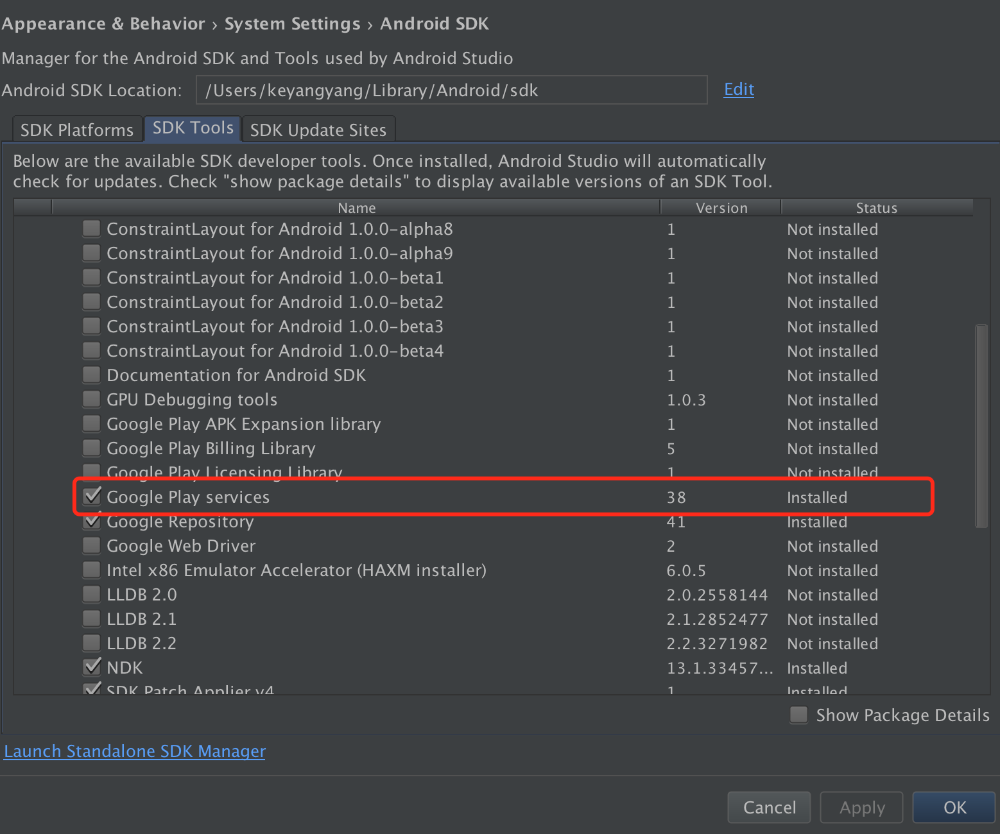
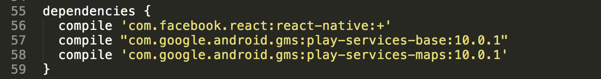

# qingyuanjie

```bash
git clone https://github.com/jibenziliao/react-native-app.git
```

```bash
npm install
```

```bash
react-native link
```


### 说明

1. react-native版本是0.38.0,不要轻易升级react-native版本。0.39.0、0.39.1、0.39.2在iOS平台跟cocoapods不太兼容,编译各种报错。本人对原生不是很熟悉,所以退而求其次,使用react-native@0.38.0

2. 因集成极光推送插件,xCode需更新到8.2.1版本,以便支持iOS10,在iOS工程target的Build Phases->Link Binary with Libraries中加入如下库

    > libz.tbd
      
    > CoreTelephony.framework
      
    > Security.framework
      
    > CFNetwork.framework
      
    > CoreFoundation.framework
      
    > SystemConfiguration.framework
      
    > Foundation.framework
      
    > UIKit.framework
      
    > UserNotifications.framework
      
    > libresolv.tbd

    关于极光推送插件详细配置,请参考极光推送插件 [jpush-react-native](https://github.com/jpush/jpush-react-native)文档,及这篇博客 [react native极光推送全程教程android和ios](http://www.jianshu.com/p/e7f81b5e1807)

### Android

#### 注意事项
1. 如下图所示,如果你的SDK Tools中的Google Play Service版本比较新,你需要更改第三方插件( [react-native-maps](https://github.com/airbnb/react-native-maps) )中的一些参数:



在node_modules/react-native-maps/Android目录下,修改build.gradle文件中的dependences为如下内容:


```bash
dependencies {
   compile 'com.facebook.react:react-native:+'
-  compile "com.google.android.gms:play-services-base:9.0.4"
-  compile 'com.google.android.gms:play-services-maps:9.0.4'
+  compile "com.google.android.gms:play-services-base:10.0.1"
+  compile 'com.google.android.gms:play-services-maps:10.0.1'
}
```


```bash
react-native run-android
```

### iOS

#### 注意事项

1. iOS真机调试无法开启dev菜单,可能跟Libraries有关,在模拟器上可以使用开发者菜单进行调试。(对原生不太熟悉,暂时没有解决)

```bash
react-native run-ios
```
